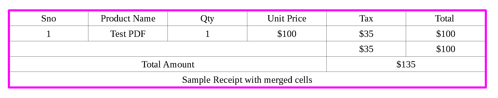
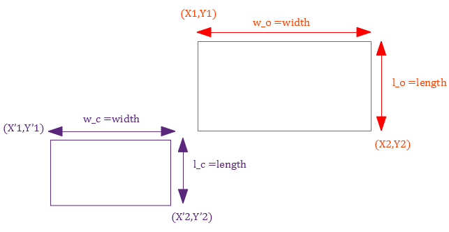
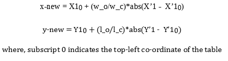
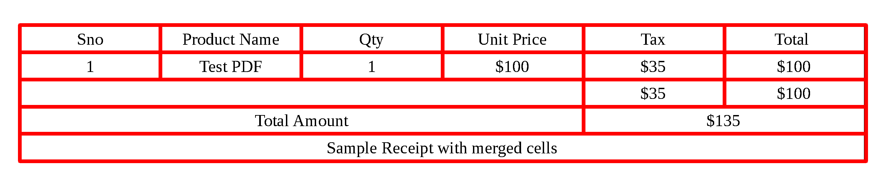

@mainpage
# Table Extraction from the PDF

## Introduction
The objective of this project is to extract tables and its cells from a PDF using python library [camelot](https://github.com/atlanhq/camelot). 

> **Note** : Camelot works better if boundaries of each cell are properly defined. It means that any two cells are separated with a solid line.

## Detection of Outer Boundary

Table extraction from a pdf can be done by a process called [**Lattice**](https://camelot-py.readthedocs.io/en/master/user/how-it-works.html#lattice). Below are the steps which it take to identify table region.

1. Converts PDF into image using [Ghostscript](https://www.ghostscript.com/)
2. Image processing to get Horizontal and Vertical Lines
3. Line segements are detected
4. Table boundaries are computed by overlapping the detected line segments by “[or](https://en.wikipedia.org/wiki/Logical_disjunction)”ing their pixel intensities.

<b> The image below shows the detected outer lines of a table --  </b>

## Detection of Cell Boundaries

Intersection points of horizontal and vertical lines are identified by Image Processing techniques and these points will be the coordinates for each cell given in the table. But, all these coordinates will be in camelot space because this library reduces the size of pdf before processing it. Hence, it is necessary to shift these coordinates from camelot space to original PDF space.

Now, this transformation can be easily done by shifting and rescaling of axes (Cartesian Coordinate System) in camelot space. If top-left coordinate of table is considered as origin for both the spaces. Then, the following approach can be used - 
1. Shifting of top-left coordinate of table_c (table in camelot space) to top_left coordinate of table_p (table in PDF space)
2. Calculate the rescaling factor for width and height. This will be the ratio of widths and heights of both the tables (ratio > 1)
3. For each cell in camelot space, multiply height and width of cell with their respective scaling factors

For example --  
* `red` : Table in `PDF` space 
* `purple` : Table in `camelot` space.

<b> Transformation equations for x and y coordinates ---  </b>

The image below is the table transformed from camelot space to pdf space.

## Usage

1. Install requirements
> pip install -r requirements.txt

2. Install Ghostscript from [here](https://www.ghostscript.com/)

3. Implementation done in jupyter notebook and notebook can be found [here](../jupyter/Lattice.html) 